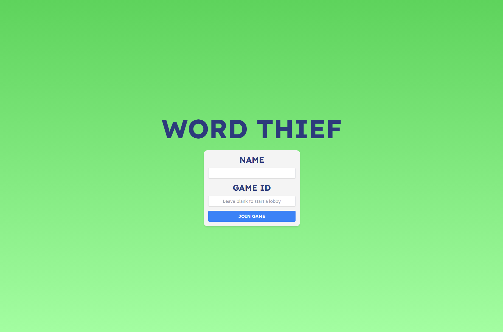
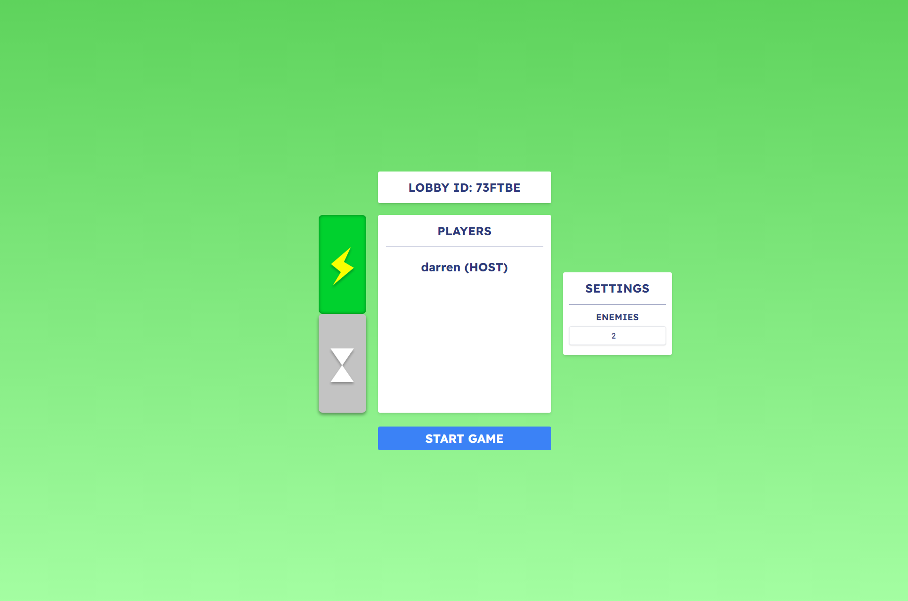
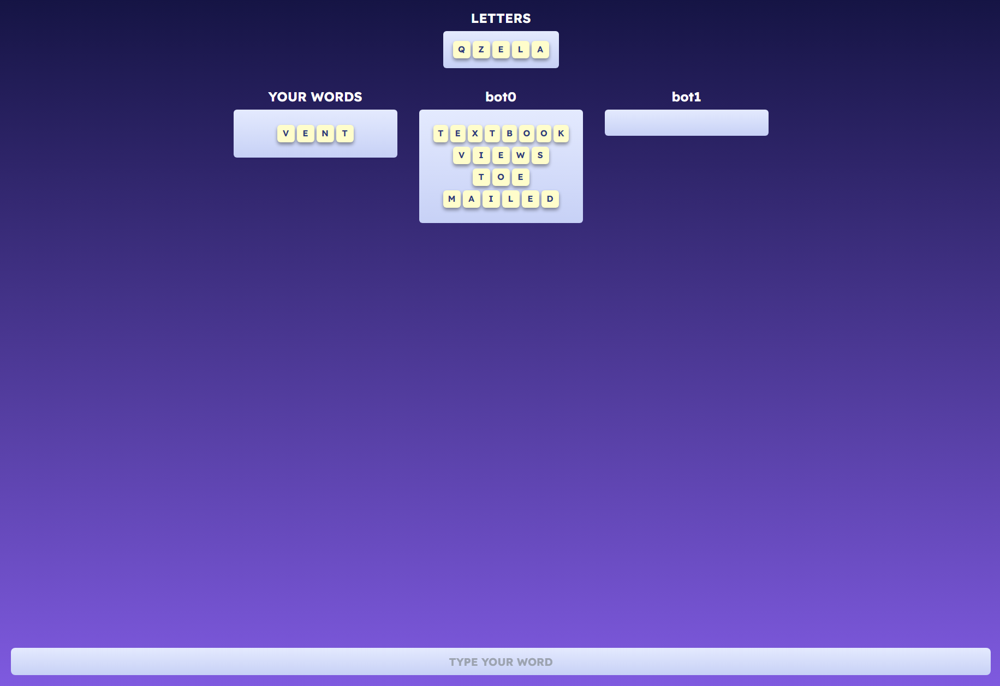

# Word Thief

## Table of Contents

- [Introduction](#introduction)
- [Features](#features)
- [Game Modes](#game-modes)
- [Screenshots](#screenshots)
- [Tech Stack](#tech-stack)
- [Setup](#setup)
- [Contributing](#contributing)
- [License](#license)
- [Contact](#contact)

## Introduction

**Word Thief** is a multiplayer word game built using React for the frontend and Flask with Socket.IO for the backend. The game allows players to compete in real-time to steal words from each other by forming words from a shared pool of letters. Whether you're playing against friends or challenging AI opponents, Word Thief provides an engaging and competitive experience.

The game is hosted at [word-thief.vercel.app](https://word-thief.vercel.app), and the source code is available here on GitHub.

## Features

- **Multiplayer Mode**: Play with friends or random players in real-time.
- **Single-Player Mode**: Challenging AI opponents, adding a layer of difficulty and fun.
- **Real-Time Updates**: Seamless game state management and updates using Socket.IO.
- **Customizable Lobbies**: Create or join lobbies with various game settings.
- **AI-Powered Agents**: Intelligent AI opponents that challenge players with competitive gameplay.
- **Multiple Game Modes**: Enjoy different game modes with varying rules and challenges.

## Game Modes

- **Flash**: Letters appear every 2 seconds, and after all 144 letters have appeared the player with the most letters wins.
- **Extended**: In this gamemode you can choose how frequently letters appear, and you play until someone makes enough words to win! Choose how many words to play to.

## Screenshots

## Tech Stack

- **Frontend**: Next.js, JavaScript, Tailwind CSS
- **Backend**: Flask, Python, Socket.IO
- **Hosting**: Vercel (frontend), Heroku/AWS (backend)

## Setup

### Prerequisites

- Node.js and npm installed
- Python 3.x installed
- Virtualenv installed

### Installation

1. **Clone the repository**:

   `git clone https://github.com/darren-shen/word-thief.git`

   `cd word-thief`

2. **Backend Setup**:

   - Navigate to the `backend` directory:

     `cd backend`

   - Create and activate a virtual environment:

     `python3 -m venv venv`

     `source venv/bin/activate`  *(On Windows use `venv\Scripts\activate`)*

   - Install the required packages:

     `pip install -r requirements.txt`

   - Replace instances of the backend URL with your own backend hosting port:

     e.g. '

   - Start the Flask server:

     `flask run`

3. **Frontend Setup**:

   - Navigate to the `frontend` directory:

     `cd ../frontend`

   - Install the dependencies:

     `npm install`

   - Start the development server:

     `npm start`

4. **Access the game**:

   - The game will be available at `http://localhost:3000`.

## Contributing

Contributions are welcome! If you have suggestions or improvements, feel free to open an issue or submit a pull request.

### Steps to Contribute:

1. Fork the repository
2. Create a new branch: `git checkout -b my-feature-branch`
3. Make your changes and commit: `git commit -m 'Add some feature'`
4. Push to the branch: `git push origin my-feature-branch`
5. Submit a pull request

## License

This project is licensed under the MIT License - see the [LICENSE](LICENSE) file for details.

## Contact

For any questions or inquiries, feel free to reach out:

- Email: `darrenshen@berkeley.edu`
- LinkedIn: [linkedin.com/in/darrenshen-ucb](https://linkedin.com/in/darrenshen-ucb)

